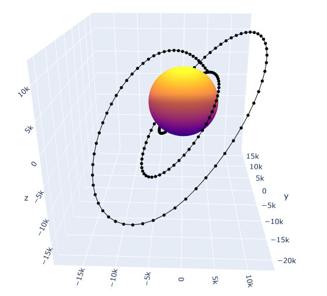
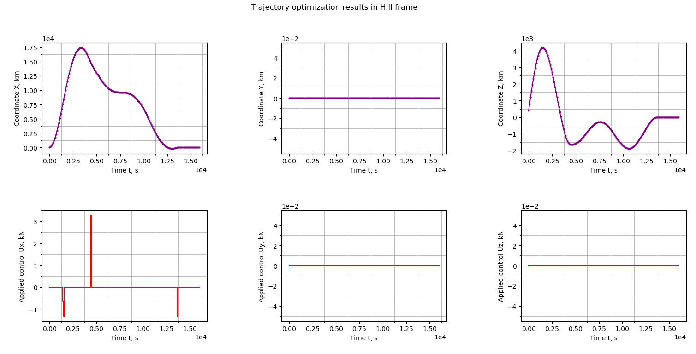
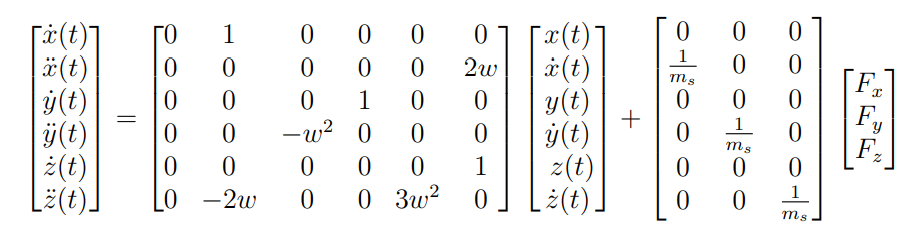
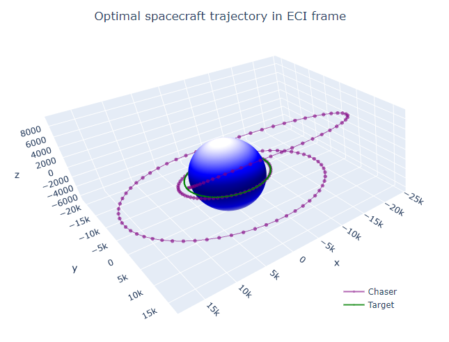

<div id="top"></div>

[![Contributors][contributors-shield]][contributors-url]
[![Forks][forks-shield]][forks-url]
[![Stargazers][stars-shield]][stars-url]
[![Issues][issues-shield]][issues-url]
[![MIT License][license-shield]][license-url]


<!-- PROJECT LOGO -->
<br />
<div align="center">
  <a href="https://github.com/kpuduls/Projects">
    
  </a>

<h3 align="center"> SPACECRAFT MPC CONTROLLER <br /> (for near circular orbits) <br />

_w visualisations_ 

</h3>

  <p align="center">
    The goal of the projects is to obtain a tool for spacecraft trajectory propagation that would aid in realistic optimal trajectory
    and thrust control plan creation for near circular LEO orbit reconfiguration, station keeping manoeuvres. 
    And visualise the propagated Local Orbital frame trajectories in Earth Centered Inertial frame
    that would help gain an overall basic understanding of these orbital mechanics modelled using relative Hills equations.
    <br />
    <a href="https://github.com/kpuduls/Projects"><strong>Explore the docs »</strong></a>
    <br />
    <br />
    <a href="https://github.com/kpuduls/Projects">View Demo</a>
    ·
    <a href="https://github.com/kpuduls/Projects/issues">Report Bug</a>
    ·
    <a href="https://github.com/kpuduls/Projects/issues">Request Feature</a>
  </p>
</div>


<!-- TABLE OF CONTENTS -->
<details>
  <summary>Table of Contents</summary>
  <ol>
    <li>
      <a href="#about-the-project">About The Project</a>
      <ul>
        <li><a href="#used-libraries">Used libraries</a></li>
      </ul>
    </li>
    <li>
      <a href="#getting-started">Getting Started</a>
      <ul>
        <li><a href="#prerequisites">Prerequisites</a></li>
        <li><a href="#installation">Installation</a></li>
      </ul>
    </li>
    <li><a href="#usage">Usage</a></li>
    <li><a href="#roadmap">Roadmap</a></li>
    <li><a href="#contributing">Contributing</a></li>
    <li><a href="#license">License</a></li>
    <li><a href="#contact">Contact</a></li>
    <li><a href="#acknowledgments">Acknowledgments</a></li>
  </ol>
</details>


<!-- ABOUT THE PROJECT -->
## About The Project

<p align="center">
    <a href="https://github.com/kpuduls/Projects">
        
    </a>
</p>

The Project has two main parts:
* mpc-spacecraft
* CW

### mpc-spacecraft

The **mpc-spacecraft** is model predictive controlled implemented using an gurobipy MILP solver.
Note that this solver free licence has limitations.
<br >
The model uses the Hills relative equations to model the dynamics of the spacecraft for near circular orbits.

<p align="center">
    <a href="https://github.com/kpuduls/Projects">
        
    </a>
</p>

The demo model includes thruster saturation limit constraints, terminal state constraints
and a cost function to minimize the cost of fuel.
<br>
It is possible to add more constraints to the model, however in that case it is advised to use the commercial licencse
of the MILP solver.
Some additional options would include multiple spacecraft / formation dynamics formulations and
error box constraints.

Use **_MILPv2.py_** as a quick starting guide.

### CW

The **CW** is Vectorized Clohessy-Wiltshire Hill Linear Trajectory Propagation scripts.
Use to propagate any orbital trajectory in ECI or Hill relative orbital frame and convert the vectorized states betweeen 
ECI <--> Hills frames.

For usage see **_LOP_Demo.py_** as a quick starting guide.

<br>
*Note* - 
Adapted from matlab
scripts written by: Darin Koblick (2022).

Vectorized Clohessy-Wiltshire Hill Linear Propagation (https://www.mathworks.com/matlabcentral/fileexchange/39340-vectorized-clohessy-wiltshire-hill-linear-propagation),
MATLAB Central File Exchange. Retrieved February 2, 2022.

<p align="center">
    <a href="https://github.com/kpuduls/Projects">
        
    </a>
</p>

<p align="right">(<a href="#top">back to top</a>)</p>


### Used libraries

* [numpy](https://nextjs.org/)
* [torch](https://reactjs.org/)
* [os](https://vuejs.org/)
* [gurobipy](https://angular.io/)
* [matplotlib](https://angular.io/)
* [plotly](https://angular.io/)


<p align="right">(<a href="#top">back to top</a>)</p>


<!-- GETTING STARTED -->
## Getting Started

To use the project locally, just clone the repository
### Prerequisites

The project requries python with the above listed libraries to be installed on the local machine
### Installation

1. Get a free API Key at [https://github.com/kpuduls/Projects](https://github.com/kpuduls/Projects)
2. Clone the repo
   ```sh
   git clone https://github.com/kpuduls/Projects.git
   ```

3. Enter your API in `config.js`
   ```js
   const API_KEY = 'ENTER YOUR API';
   ```

<p align="right">(<a href="#top">back to top</a>)</p>


<!-- USAGE EXAMPLES -->
## Usage

### Combined project

Use the **_plot-optimal-trajectory.py_** in directory CW for a quick start guide. 

### Using mpc-spacecraft files

Use this space to show useful examples of how a project can be used. Additional screenshots, code examples and demos work well in this space. You may also link to more resources.

_For more examples, please refer to the [Documentation](https://www.gurobi.com/resource/tutorial-mixed-integer-linear-programming/)_

<p align="right">(<a href="#top">back to top</a>)</p>

### Using CW files

Use this space to show useful examples of how a project can be used. Additional screenshots, code examples and demos work well in this space. You may also link to more resources.

_For more examples, please refer to the [Documentation](https://www.mathworks.com/matlabcentral/fileexchange/39340-vectorized-clohessy-wiltshire-hill-linear-propagation)_

<p align="right">(<a href="#top">back to top</a>)</p>


<!-- ROADMAP -->
## Roadmap

- [ ] Feature 1
- [ ] Feature 2
- [ ] Feature 3
    - [ ] Nested Feature

See the [open issues](https://github.com/kpuduls/Projects/issues) for a full list of proposed features (and known issues).

<p align="right">(<a href="#top">back to top</a>)</p>


<!-- CONTRIBUTING -->
## Contributing

Contributions are what make the open source community such an amazing place to learn, inspire, and create. Any contributions you make are **greatly appreciated**.

If you have a suggestion that would make this better, please fork the repo and create a pull request. You can also simply open an issue with the tag "enhancement".
Don't forget to give the project a star! Thanks again!

1. Fork the Project
2. Create your Feature Branch (`git checkout -b feature/AmazingFeature`)
3. Commit your Changes (`git commit -m 'Add some AmazingFeature'`)
4. Push to the Branch (`git push origin feature/AmazingFeature`)
5. Open a Pull Request

<p align="right">(<a href="#top">back to top</a>)</p>


<!-- LICENSE -->
## License

Cite the above mentioned matlab adaptations as well as this project with this repo URL.

<p align="right">(<a href="#top">back to top</a>)</p>


<!-- CONTACT -->
## Contact

Name: Krisjanis Puduls

Email link: [puduls.krisjanis@gmail.com](puduls.krisjanis@gmail.com)

Project Link: [https://github.com/kpuduls/Projects](https://github.com/kpuduls/Projects)

<p align="right">(<a href="#top">back to top</a>)</p>


<!-- ACKNOWLEDGMENTS -->
## Acknowledgments

* []()
* []()
* []()

<p align="right">(<a href="#top">back to top</a>)</p>


<!-- MARKDOWN LINKS & IMAGES -->
<!-- https://www.markdownguide.org/basic-syntax/#reference-style-links -->
[contributors-shield]: https://img.shields.io/github/contributors/kpuduls/Projects.svg?style=for-the-badge
[contributors-url]: https://github.com/kpuduls/Projects/graphs/contributors
[forks-shield]: https://img.shields.io/github/forks/kpuduls/Projects.svg?style=for-the-badge
[forks-url]: https://github.com/kpuduls/Projects/network/members
[stars-shield]: https://img.shields.io/github/stars/kpuduls/Projects.svg?style=for-the-badge
[stars-url]: https://github.com/kpuduls/Projects/stargazers
[issues-shield]: https://img.shields.io/github/issues/kpuduls/Projects.svg?style=for-the-badge
[issues-url]: https://github.com/kpuduls/Projects/issues
[license-shield]: https://img.shields.io/github/license/kpuduls/Projects.svg?style=for-the-badge
[license-url]: https://github.com/kpuduls/Projects/blob/main/LICENSE.md

